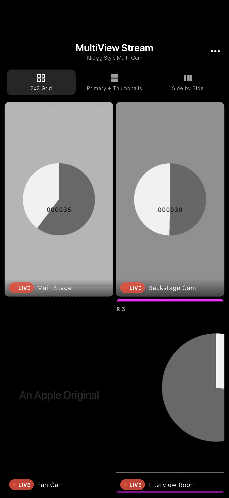
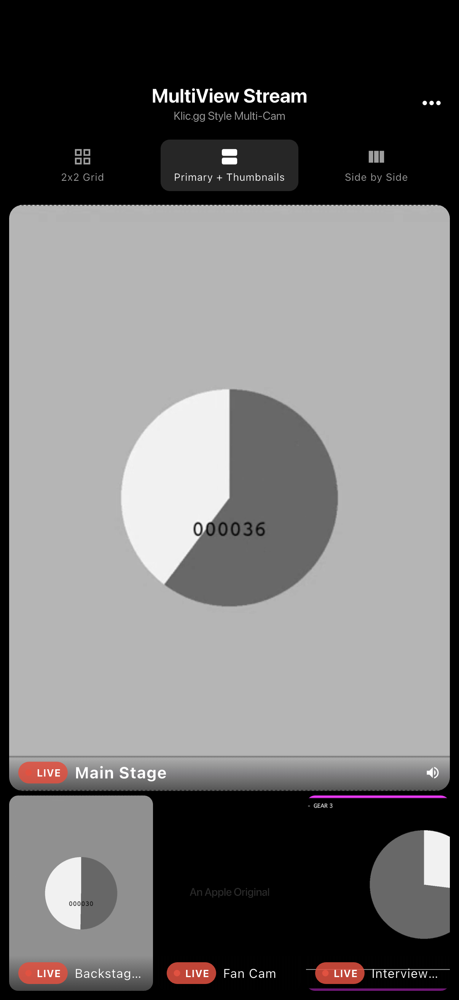
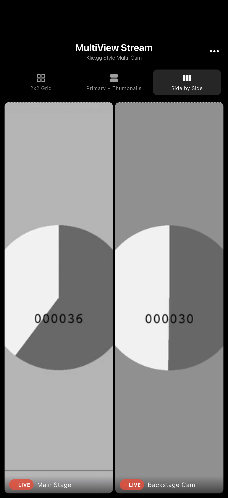
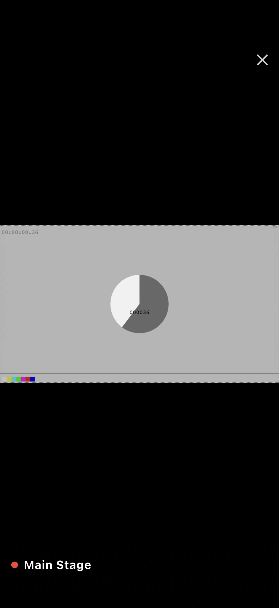
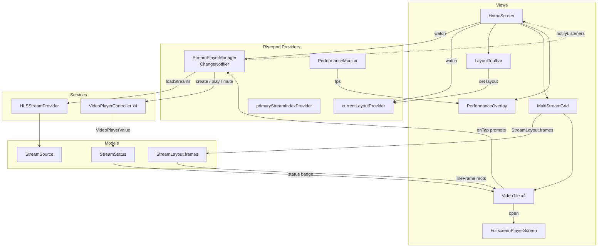

# MultiView Livestream

A Flutter POC for **multi-cam livestreaming** - watch four HLS streams at once, Klic.gg style. Tap any feed to promote it, switch layouts on the fly, and go fullscreen. Built with `video_player` for true concurrent HLS playback and Riverpod for state.

## Demo


| 2x2 Grid | Primary + Thumbnails | Side by Side | Fullscreen |
| --- | --- | --- | --- |
|  |  |  |  |

Screenshots are real captures from the iOS Simulator (integration_test driver), playing Apple's public HLS test streams.

## What it shows

- **Concurrent HLS playback** - 4 `VideoPlayerController` instances initialize and play together, all muted except the primary feed.
- **Three layouts** - `2x2 Grid`, `Primary + Thumbnails`, `Side by Side`. Tile rectangles are computed in pure geometry code (`StreamLayout.frames`) and animated with `AnimatedPositioned`, so layout switches morph smoothly without rebuilding players.
- **Tap to promote** - tapping a tile makes it primary, unmutes only that stream, and mutes the rest.
- **Per-stream status** - LIVE / buffering / paused / error badges driven by each controller's `VideoPlayerValue`.
- **Immersive fullscreen** - single-stream player with auto-hiding controls and swipe-down to dismiss.
- **FPS overlay** - optional real-time frames-per-second meter (Ticker based), color-coded green/yellow/red.

## Architecture

State is a single `StreamPlayerManager` (`ChangeNotifier`) exposed through Riverpod. The manager owns every `VideoPlayerController`, tracks status, and handles audio focus (one unmuted stream). Views are thin and rebuild from `ref.watch`. Layout math lives in the `StreamLayout` enum, fully decoupled from widgets and unit-tested.



### Control flow

1. `HomeScreen` loads sources from `HLSStreamProvider` and calls `startAllStreams()`.
2. `StreamPlayerManager` spins up one `VideoPlayerController` per source, initializes, loops, mutes all, then unmutes the primary.
3. `MultiStreamGrid` asks `StreamLayout.frames(...)` for tile rectangles and lays out `VideoTile`s with `AnimatedPositioned`.
4. A tile tap routes through `HomeScreen._handleTileTap` - promote to primary, change layout, or open fullscreen depending on current layout.
5. Any controller change calls `notifyListeners()`; Riverpod rebuilds only the widgets that watch it.

## Project structure

```
lib/
  models/        StreamSource, StreamLayout (frame geometry), StreamStatus
  services/      StreamPlayerManager, HLSStreamProvider, PerformanceMonitor
  views/         HomeScreen, FullscreenPlayerScreen
  views/widgets/ MultiStreamGrid, VideoTile, LayoutToolbar, PerformanceOverlay
```

## Run

```bash
flutter pub get
flutter run
```

Needs network access for the Apple HLS test streams. Tested on the iOS Simulator (iPhone 17 Pro) and Android.

## Stack

Flutter - Dart - video_player (HLS) - flutter_riverpod - MVVM - AnimatedPositioned - LayoutBuilder - integration_test
